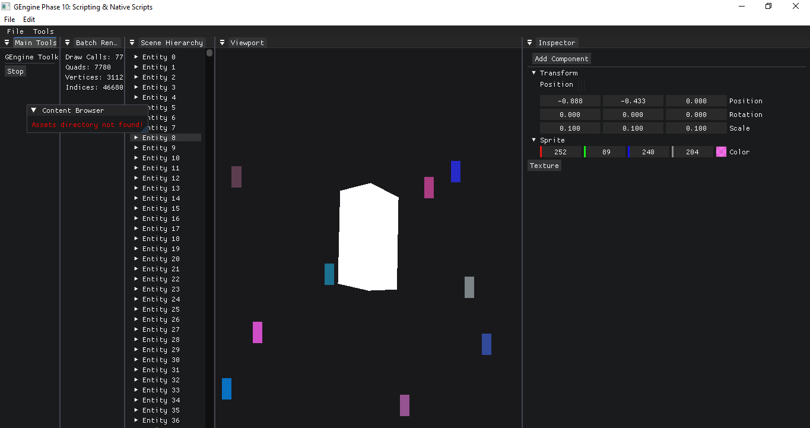

# GEngine

A high-performance, high-aesthetic 2D/3D game engine built with C++20 and OpenGL 4.5.



## 🚀 Features

- **ECS Architecture**: Custom Entity-Component-System with packed storage for maximum cache efficiency.
- **Editor Module**: Integrated **Dear ImGui** with Docking and Multi-Viewport support for a professional IDE feel.
- **Scene Hierarchy & Inspector**: Real-time entity management and property editing.
- **High-Performance 2D Batching**: Optimized Renderer2D capable of drawing thousands of quads in a single draw call.
- **Native Scripting**: C++ based scripting system via `ScriptableEntity` and `NativeScriptComponent`.
- **Modern Math Library**: Zero-overhead, constexpr-first `Vec`, `Mat`, and `Quat` types.
- **OpenGL 4.5 Renderer**: Shader-based abstraction (VAO/VBO/EBO) with Framebuffer support for Viewports.
- **Logging & Debugging**: Integrated diagnostic logging and robust path-probing for assets.

## 🛠️ Tech Stack

- **Language**: C++20
- **Graphics**: OpenGL 4.5+ (Planned DX11 support)
- **UI**: Dear ImGui (Docking branch)
- **Windowing**: GLFW
- **Loader**: GLAD
- **Build System**: CMake

## 📦 Getting Started

### Prerequisites

- **Windows**: Visual Studio 2022 or VS Code with Microsoft C++ Extension.
- **CMake**: 3.20 or higher.
- **Vulkan/SDK** (Optional): For future-proofing graphics backends.

### Build Instructions (VS Code)

1. **Clone the repository**:
   ```powershell
   git clone https://github.com/Wsh7Ash/GEngine.git
   cd GEngine
   ```

2. **Build & Run**:
   - Open the project in VS Code.
   - Press `F5` to trigger the **CMake Build** task and start the debugger.
   - Or run via terminal:
     ```powershell
     cmake -B build
     cmake --build build --config Debug
     ./build/bin/Debug/GameEngine.exe
     ```

## 🎮 Controls

- **WASD / Arrows**: Move the camera (via `CameraController` script).
- **Drag & Drop**: Drag assets from the Content Browser to the Inspector/Viewport.
- **Right-Click**: Context menus in Hierarchy for entity creation/deletion.

## 📁 Project Structure

- `src/core/`: Engine core systems (Math, ECS, Platform, Renderer, Editor).
- `src/shaders/`: GLSL batch and basic shaders.
- `assets/`: Textures and scene data.
- `build/`: CMake build output.

## 📜 License

This project is licensed under the MIT License.
