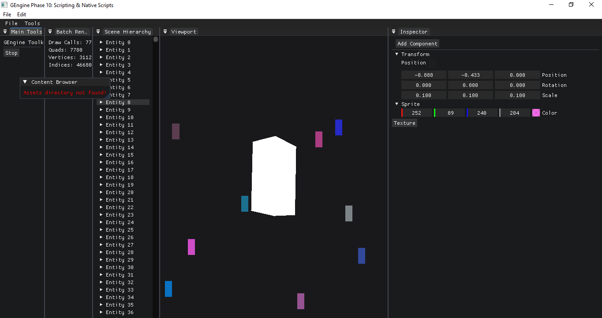

# GEngine

A high-performance, high-aesthetic 2D/3D game engine built with C++20 and OpenGL 4.5.



## 🚀 Features

- **ECS Architecture**: Custom Entity-Component-System with packed storage for maximum cache efficiency.
- **Editor Module**: Integrated **Dear ImGui** with Docking and Multi-Viewport support for a professional IDE feel.
- **Scene Hierarchy & Inspector**: Real-time entity management and property editing.
- **High-Performance 2D Batching**: Optimized Renderer2D capable of drawing thousands of quads in a single draw call.
- **Native Scripting**: C++ based scripting system via `ScriptableEntity` and `NativeScriptComponent`.
- **Modern Math Library**: Zero-overhead, constexpr-first `Vec`, `Mat`, and `Quat` types.
- **Multi-Backend Renderer**: OpenGL 4.5, DX11, Vulkan, and WebGL2 backends.
- **WebAssembly Support**: Build and run in the browser via Emscripten.
- **Networking**: Client-server architecture with replication, client-side prediction, and lag compensation.
- **Physics**: 2D (Box2D) and 3D (Jolt Physics) integration.
- **Audio**: miniaudio-based sound engine.
- **Logging & Debugging**: Integrated diagnostic logging and robust path-probing for assets.

## 🛠️ Tech Stack

- **Language**: C++20
- **Graphics**: OpenGL 4.5+, DX11, Vulkan, WebGL2
- **UI**: Dear ImGui (Docking branch)
- **Windowing**: GLFW
- **Loader**: GLAD
- **Physics**: Box2D (2D), Jolt Physics (3D)
- **Audio**: miniaudio
- **Build System**: CMake
- **Testing**: Catch2

## 📦 Getting Started

### Prerequisites

- **Windows**: Visual Studio 2022 or VS Code with Microsoft C++ Extension.
- **Linux**: GCC 11+ or Clang 13+ with development libraries (`libgl1-mesa-dev`, `libxrandr-dev`, etc.)
- **macOS**: Xcode Command Line Tools.
- **CMake**: 3.20 or higher.
- **Emscripten** (Optional): For WebAssembly builds.

### Build Instructions

1. **Clone the repository**:
   ```powershell
   git clone --recurse-submodules https://github.com/Wsh7Ash/GEngine.git
   cd GEngine
   ```
   > **Note**: Use `--recurse-submodules` to fetch all dependencies. If already cloned, run `git submodule update --init --recursive`.

   2. **Build & Run**:
   ```powershell
   cmake -B build -G Ninja -DCMAKE_BUILD_TYPE=Debug
   cmake --build build --parallel
   ./build/bin/Debug/GameEngine.exe
   ```
   > **Tip**: Use `-G Ninja` for faster builds.

   3. **Run Tests**:
   ```powershell
   cmake -B build -G Ninja -DBUILD_TESTS=ON -DCMAKE_BUILD_TYPE=Debug
   cmake --build build --parallel
   ctest --test-dir build --output-on-failure
   ```
   Or use the convenience script:
   ```powershell
   .\scripts\run_tests.bat    # Windows
   ./scripts/run_tests.sh     # Linux/macOS
   ```

   4. **WebAssembly Build** (requires Emscripten):
   ```bash
   source emsdk_env.sh
   emcmake cmake -B build-web -G Ninja -DCMAKE_BUILD_TYPE=Release
   cmake --build build-web --parallel
   # Open build-web/bin/GameEngine.html in a browser
   ```

   5. **Dedicated Server**:
   ```powershell
   cmake -B build -G Ninja -DGE_DEDICATED_SERVER=ON -DCMAKE_BUILD_TYPE=Release
   cmake --build build --parallel
   ./build/bin/Release/GameServer.exe --help
   ```

## 🧪 Creating a New Game

The easiest way to start a new game project is to use the SDK template:

1. **Copy the template**:
   ```powershell
   cp -r sdk/templates/new_game MyGame
   cd MyGame
   ```

2. **Configure and build**:
   ```powershell
   cmake -B build -DGEngine_DIR=path/to/GEngine/build/lib/cmake/GEngine
   cmake --build build
   ```

3. **Edit `main.cpp`** and start building your game!

## 🎮 Controls

- **WASD / Arrows**: Move the camera (via `CameraController` script).
- **Drag & Drop**: Drag assets from the Content Browser to the Inspector/Viewport.
- **Right-Click**: Context menus in Hierarchy for entity creation/deletion.

## 📁 Project Structure

- `src/core/`: Engine core systems (Math, ECS, Platform, Renderer, Editor, Networking).
- `src/server/`: Dedicated server application.
- `src/shaders/`: GLSL shaders.
- `assets/`: Textures and scene data.
- `tests/`: Unit, integration, and stress tests.
- `docs/`: API documentation and implementation guides.
- `sdk/`: SDK examples, templates, and packaging.
- `include/GEngine/`: Public API headers for SDK consumers.
- `cmake/`: CMake toolchains and helper modules.
- `build/`: CMake build output.

## 🤝 Contributing

For detailed contribution guidelines including build troubleshooting and test filtering, see [CONTRIBUTING.md](CONTRIBUTING.md).

## 📜 License

This project is licensed under the MIT License.
